# Dungeon Crawler
### Algorithms for Decision Making Project
#### Austin J. Erickson

## Description
A repository for my Algorithms for Decision Making class project. The project involves coding a dungeon crawler and having a decision-making algorithm solve it. It can also be played by a human.

The following algorithms were created to play this game:

### MDP Value Function
A simple value function that is able to "cheat" and gain full knowledge of the floor setup, monster positions, treasure positions, and the exit. It will precompute an "optimal" path but be unable to adjust based on state changes.

The other major difference between this agent and the other two is that, because HP is a discrete value from 0-100, that portion of the state is not added here in order to save on calculation time (it explodes when taking HP into account). Because of this, the agent will always attack monsters, since it doesn't have a "fear" of losing all its health.

### MCTS
A Monte Carlo Tree Search algorithm that will also have full knowledge of the floor, but will be able to adjust to state changes and make decisions at every step.

### POMCP
A Partially Observable MCTS algorithm that uses a particle filter to estimate state and actions based on limited observed information. Other than that, it follows logic identical to MCTS.

## Rules

1. The agent's goal is to obtain as much treasure as possible and exit the dungeon.
2. The agent can move in any cardinal direction, attack, or exit (if applicable).
3. Treasure rewards range from 50-500 positive points.
4. Monsters seek to stop the agent.
5. Monsters always attack first.
6. If the agent reaches 0 HP, it dies and banks nothing.
7. Defeating monsters gives points equal to how difficult they were to defeat.
8. Monsters remain motionless unless they see the agent. Upon seeing the agent, they move toward it, as long as there is an unbroken line of sight.
9. If a monster loses sight of the agent for three "steps" (movements), it becomes idle again.
10. The agent can only see three tiles away, or tiles already revealed.
11. The agent ONLY gets positive points for reaching the exit with treasure. There is no penalty for lost HP.
12. Failure to exit the dungeon with treasure results in a score of 0, making scores range from 0 to (total treasure and killed monsters).
13. Only 200 steps are allowed per game.

## Configuration

- Adjustable parameters (e.g., treasure values, visibility range, HP, number of monsters, etc.) can be modified in `dungeon_env.py`.
- The size of the playing field can be configured in `play.py` or `run_agent.py`. Unless changed, the number of rooms, treasures, and monsters is scaled loosely based on room size.

`run_agent` parser arguments available:

| Argument | Default | Recommended | Description |
|---|---|---|---|
| `--agent` | `mdp` | `mcts` (general), `pomcp` (partial observability), `mdp` (baseline) | Agent to run (`mdp`, `mcts`, or `pomcp`) |
| `--size` | `20` | `12`–`30` | Width/height of the dungeon grid (larger sizes are difficult for the MDP agent) |
| `--episodes` | `1` | `1`–`50` | Number of episodes to simulate |
| `--seed` | `None` | `None` | Seed value for reproducible runs |
| `--delay` | `0.15` | `0.05`–`1` | Delay in seconds per step |
| `--no-display` | `False` | `False` (batch runs), `True` (debug/demo) | Render the game window during runs |
| `--cheat` | `False` | Either `True` or `False` | Show the full map on each render |
| `--fog` | `False` | Either `True` or `False` | Show fog (limited vision of agent/human player) |
| `--verbose` | `False` | `True` for experiments | Display updates during agent play |

## How to Run Game and Algorithms
### Human-Played Game
Run the `play.py` file. A window will appear displaying the game. Enter commands into the terminal followed by `Enter` to play. (Future developments will allow easier play, but this was added later.)

### Agent-Played Game
Run the following command in the terminal when in the project directory:

`python run_agent.py` OR `python3 run_agent.py` followed by whatever arguments you want to add (see [Configuration](#configuration) above). Specifically, `--agent mdp`, `--agent mcts`, and `--agent pomcp` allow you to select which agent you would like to run.

Example terminal entry (when in the project directory):

`python3 run_agent.py --agent mcts --size 20 --episodes 10 --delay 0.1 --cheat --verbose`

This simulates an MCTS agent playing 10 episodes on 10 different randomly generated dungeons of size 20 with a 0.1-second delay between each move (plus computation time). You can see the full map during play and receive a detailed log of events during each run.

## AI Disclosure

GitHub Copilot autocomplete was used to assist in autocompletion of lines and code (under heavy scrutiny). Furthermore, Claude was used to clean up (remove unnecessary lines) and debug code, as well as add small annotations to various sections for easier understanding.

In summary, all major functions, code structure, and algorithms were human-made, and only AI-edited as needed.

Certain helper functions were later added to fix bugs and run the main agents better, and are disclosed in comments under those functions.

All AI-assisted code is annotated, stating how much AI was used in its creation.

## Summary of Project-Important Files in this Repository

### `dungeon_env.py`

Class that creates and manages dungeon objects and logic.

### `mcts_agent.py`

Monte Carlo Tree Search agent class. Retains all logic and decision-making processes for this agent.

### `mdp_agent.py`

Markov Decision Process agent class. Retains all logic and decision-making processes for this agent.

### `play.py`

File available for human play.

### `pomcp_agent.py`

Partially Observable Monte Carlo Planning agent class. Retains all logic and decision-making processes for this agent.

### `run_agent.py`

Code to run one or multiple iterations of an agent.

### `visualize.py`

Code to visualize the game board. Future iterations will have images in place of squares for more dynamic viewing.

## Summary of Non-Project-Important Files in this Repository (can be ignored)

### `experiment_results.json`

File of multiple runs done for comparison. Data will be analyzed in figure form in the final video.

### `run_multiple_agents.py`

File used to allow multiple agents to run over the weekend to produce results in `experiment_results.json`. 50 episodes at dungeon sizes 12, 18, 24, and 30 were run.

### `analyze_json_data.py`

Code used to generate box-and-whisker plots for multi-agent analysis.

### `analyze_win_rate.py`

Code used to generate win-rate plots for multi-agent analysis.

## Summary of Results Seen (Report on Final Project - Not necessary for running agents or playing the game)

(For visual information, plots generated in the "outputs" folder have been placed in corresponding sections. All figures generated can be seen below or in that folder.)

### Background on Results Collection

Originally, it was planned to analyze all three agents on dungeons of size 12, 18, 24, and 30 and observe interesting behavior. Each agent would run 50 episodes on each board size, resulting in 200 runs per agent. Unfortunately, the runtime for the MDP agent caused the size 30 dungeon to take too long to run. This will be discussed later. For that reason, the MDP agent only ran on sizes 12, 18, and 24.

After the initial run, subsequent runs were done under the same parameters (though not the same seeds) in order to compare results and control for random behavior. The analysis below is based on all such results.

### Reward and Treasure

The reward and treasure metrics can be used to judge how successful different agents are at completing their task. The reward metric shows how much the agents were rewarded for individual actions, whereas the treasure metric shows how much they actually scored.

In the reward metric, we see that MDP consistently scores highest. This is misleading, however, as its reward structure had to be created differently from MCTS and POMCP. Because of this, the only important thing we can see in MDP's reward trend is the mean staying consistently higher, while the standard deviation grows with dungeon size.

The MCTS and POMCP agents are more similar, as their reward structure is effectively identical (minus a small exploration bonus for POMCP). Despite this small bonus, MCTS's mean is consistently higher due to its larger knowledge base.

Results from experiment 1 (top) and 2 (bottom)  
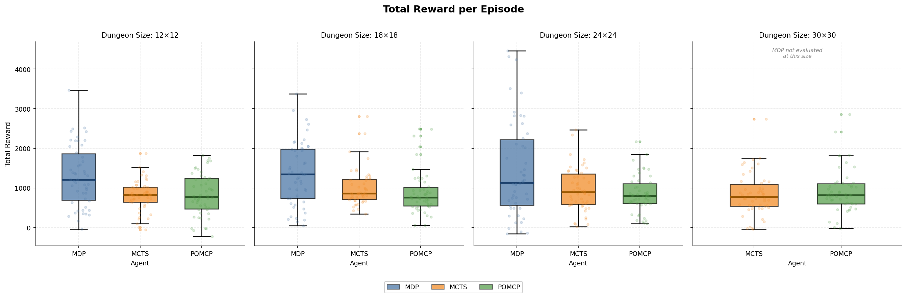  
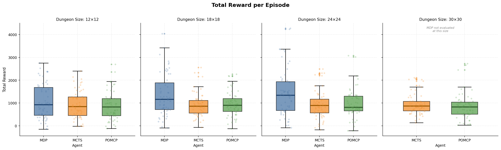

In terms of treasure, the results tell a far different story, and now all three agents can be compared together. Interestingly, treasure scores stay fairly consistent between dungeon sizes for the MCTS and POMCP agents, with only minor variability in standard deviation. For the MDP agent, however, the mean can sharply drop, indicating an over-aggressive agent caused by the inability to know the HP state.

Results from experiment 1 (top) and 2 (bottom)  
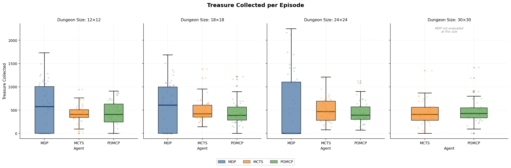  
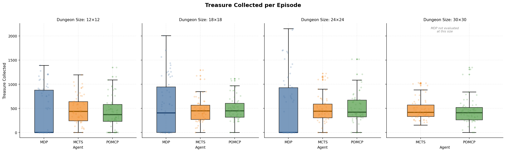

These results show that, despite being rewarded more, the MDP agent was too greedy, resulting in frequent deaths. Though its best runs were far better than the best runs for MCTS or POMCP, it is not as consistent as the other two agents. Interestingly, the POMCP and MCTS agents performed similarly, despite the MCTS agent's extra information.

### Steps to Completion

This metric is slightly harder to quantify at larger dungeon sizes due to the step cap implemented to cut down on infinite dungeon exploration time. This especially impacts POMCP, as it operates on less information and attempts to explore longer. It also impacts the MCTS agent, as it occasionally displayed "wandering" behavior, moving around the same area due to a "local maximum" reward calculation. This occurred even when logic was implemented to penalize remaining in the same area.

Outside of those issues, MDP performed best, able to compute the most efficient path each time and take the minimum number of steps, even at larger dungeon sizes. While MCTS and POMCP can often have smaller averages, similar to MDP, their upper bound often approaches the maximum possible step size, resulting in more inefficient pathing.

Results from experiment 1 (top) and 2 (bottom)  
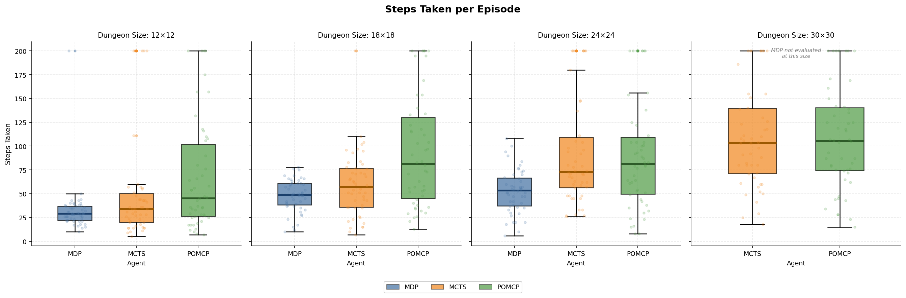  
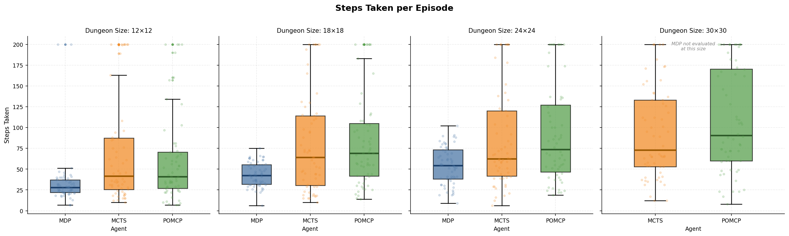

### Time to Run

This was the most shocking metric to evaluate. On initial graphing, I was astounded to find the stark difference in the time it took agents to complete episodes. The MDP took so long to run at larger sizes that not only did I need to exclude it from larger dungeon sizes earlier, but I could not even successfully evaluate a graph with it plotted on the 24x24 dungeon size. An example is shown in the figure below.

Results from experiment 1 (top) and 2 (bottom)  
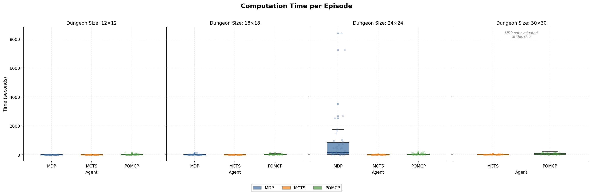  
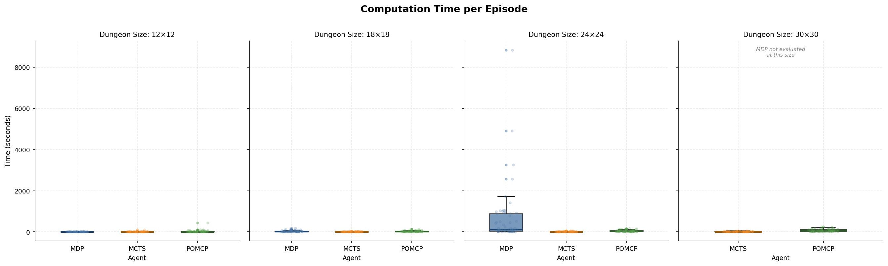

In order to better evaluate the other agents, the MDP agent was removed from the 24x24 dungeon size. The following more legible figure was created:

Results from experiment 1 (top) and 2 (bottom)  
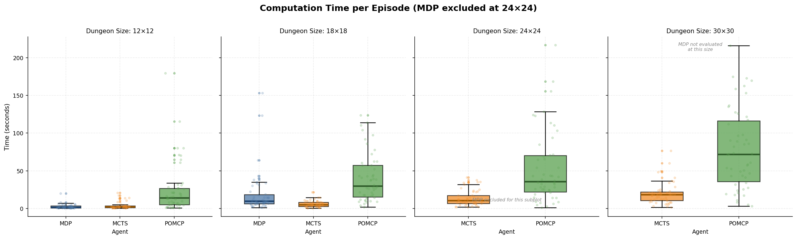  
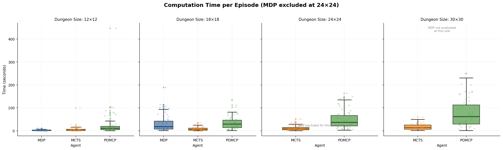

The more legible figures show that, as expected, POMCP takes longer to run, because for every tree search, it needs to generate a particle field of potential states in the unobserved region. Even so, we can see how the MDP agent takes more time as the size of the dungeon—and number of possible states—increases. The time increase potentially approaches a superexponential curve, resulting in highly inefficient runs and decision times in more complex environments. Even with longer time, POMCP still takes a few minutes at most to complete a single episode, whereas MDP can approach hours or potentially even days.

As expected, the best performance was shown by MCTS, which consistently took under a minute to complete an episode, even in larger dungeon sizes. This is most likely due to the fact that each decision made by an MCTS agent effectively takes the same amount of time, dictated only by how many rollouts you program the agent to perform.

### Success Rate

The final metric analyzed was an extrapolation of the treasure metric, indicating how many agents in a run of 50 episodes successfully exited the dungeon with treasure.

Results from experiment 1 (left) and 2 (right)

    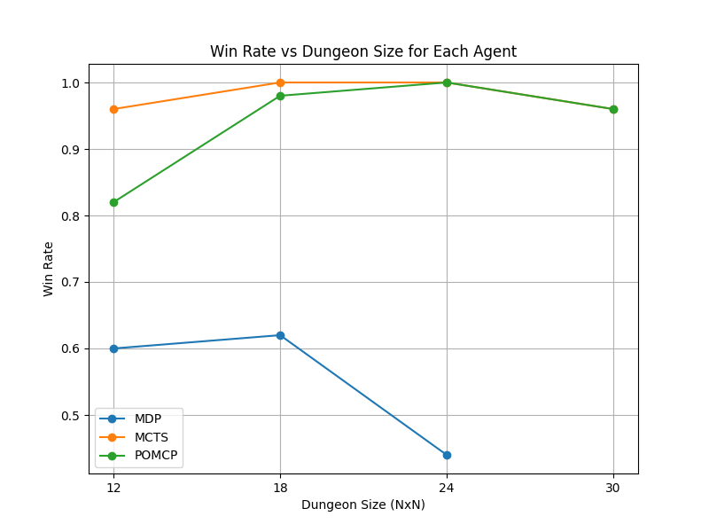
    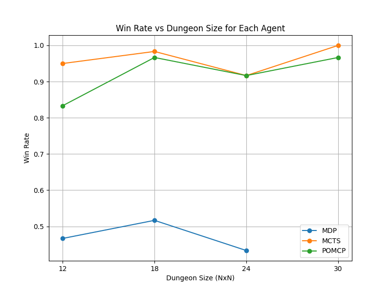

As stated earlier, though MDP can exit with far more treasure, it has an awful win rate when compared to MCTS and POMCP. Due to the higher prevalence of monsters at larger dungeon sizes, and MDP's inability to fear for its own life, it begins losing quickly over the course of multiple runs.

Interestingly, MCTS and POMCP perform very similarly at larger dungeon sizes, with the first experiment showing convergence past a 24x24 dungeon size. Even when they do not converge, the win rate is still very high for both agents, especially compared to MDP.

### Conclusion

Based on the metrics analyzed, all three agents display different strengths and weaknesses. All three agents are analyzed below, followed by a final verdict.

#### MDP Agent

The MDP agent's biggest weakness is the time it takes to make a decision. While it can complete the dungeon in fewer steps than the other agents, its comprehensive approach causes it to overanalyze the board and requires recalculation every time the state of the board changes (i.e., when monsters move).

This problem was so prevalent that the agent was unable to have knowledge of its own HP for self-preservation, resulting in a low success rate. Though its riskier approach allowed it to bank more treasure, its computation requirements made it difficult to perform well when many states are present.

#### MCTS Agent

The MCTS agent was a very successful stepping stone from MDP to POMCP. It was able to sharply reduce computation time and still receive decent treasure and reward scores. On top of that, because of its computational efficiency, its success rate was excellent, allowing it to be an all-around useful agent.

#### POMCP Agent

POMCP retained much of the benefits of MCTS. Though its reward, treasure, and success scores could be slightly lower than MCTS, it is a much more faithful representation of an actual human player.

The only issue I would correct in the future when making an agent like this is improving the logic for generating an unobserved state, adding methods to decrease computation time, and producing a more likely and faithful version of the actual dungeon.

#### Final Verdict

While MDP shined in many metrics, its problems outweigh its usefulness. While using that kind of agent can allow you to gamble for a higher score, you will often end up waiting longer than you would like for the agent to run, even with full knowledge of the board state.

POMCP was the best representation of a human player. It utilized the benefits of MCTS to make decisions quickly and logically, and was able to estimate states it did not have knowledge of. While it still could be improved for actual implementation, it represents the best decision-making agent to compare against human skill. If I were coding an actual video game similar to the one I have created, I would use some form of this POMCP agent to act as potential AI players for the human user to compete against.